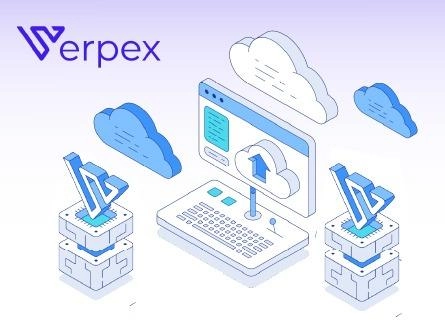

# Struggling with Shared Hosting? Here's Why VPS Hosting Might Be Your Answer

Ever felt stuck trying to deploy your app online? Ever dealt with slow load times or sudden crashes during traffic spikes on shared hosting? If that sounds familiar, then we're here to help. We've put together a handpicked list of the best VPS hosting for developers.

VPS hosting is packed with developer-friendly tools like full root access, SSH control, scalable environments, and your choice of Linux, Windows, or any OS you prefer. This article breaks down the best VPS hosting options for developers—tested by our team, beginner-friendly, and performance-focused.

---

## What Is VPS Hosting for Developers?

Imagine you're throwing a party. Instead of sharing a big hall with random people (like shared hosting), you get your own private room where you can set things up however you want. That's basically what VPS hosting is.

VPS stands for Virtual Private Server. It gives you a dedicated slice of a physical server using virtualization technology—just for your app (meaning no sharing). It's like having your own mini-server inside a bigger one, with guaranteed resources and more control.

When you're hosting an application, you need more than just space. You need speed, security, control, and reliability. With VPS hosting, you get full root access, which means you can easily install any software, tweak server configurations, and test things as you like without restrictions. It also offers better performance and higher uptime compared to shared hosting, so your application won't slow down.

For developers, this opens up a whole new world. You can test code, deploy web apps with frameworks like Node.js or Laravel, and run databases without worrying about someone else's site crashing. You also get scalable resources, so as your app grows, your server can grow with it.

Looking for a VPS solution that matches your development workflow? Vultr offers powerful cloud infrastructure designed for flexibility and speed. Whether you're deploying a staging environment or running production workloads, Vultr's global network and developer-friendly tools make scaling simple and reliable.

👉 [Deploy your next project with Vultr's high-performance cloud servers](https://www.vultr.com/?ref=9738262-9J)

---

## 9 Best VPS Hosting for Developers in 2025

Now that we know what VPS hosting actually is and how it helps developers test, deploy, and host online applications, here's a list of the best VPS hosting for developers with unique features and updated pricing to give you an idea.

**⏰ TL;DR:**

1. **YouStable** - Overall best VPS hosting for developers  
2. **InMotionHosting** - Best VPS hosting for developers  
3. **Verpex** - Affordable VPS hosting for developers  
4. **ScalaHosting** - Cloud VPS hosting for developers  
5. **DigitalOcean** - Flexible VPS hosting for developers  
6. **Hosting.com** - Ultra Fast NVMe SSD VPS for developers  
7. **LiquidWeb** - Developer-friendly VPS for developers  
8. **Vultr** - Affordable cloud VPS for developers  
9. **HostArmada** - Friendly VPS for developers

---

### 1. YouStable - Overall Best VPS Hosting for Developers

What's the first best VPS for developers? It's YouStable, one of our top picks for developers looking for a VPS hosting solution that offers developer-friendly tools and secure server access via SSH keys.

YouStable's VPS features are specifically designed to meet developers' needs, providing full root access, scalable resources, and advanced security measures. Beyond these features, YouStable offers 24/7 customer support, weekly backups, and a 30-day money-back guarantee, providing developers with a reliable and supportive hosting environment.

**Key Features:**

🔶 **Full Root Access with SSH & SFTP:** YouStable offers full root access, allowing developers to control servers so they can easily install custom software, configure server settings, and manage files via secure SSH and SFTP protocols.

🔶 **High-Performance NVMe SSD Storage:** YouStable's VPS servers have built-in NVMe SSD storage, which offers faster data transmission speeds. This results in faster application load times, improving the app's UX.

🔶 **Strong Security Measures:** The company offers advanced security features including DDoS protection and BitNinja security to protect your server from malicious attacks. What does this do? It maintains server reliability and uptime, ensuring your applications stay safe.

🔶 **Free Website Migration:** Want to switch to YouStable? Don't worry! With their free migration, it's become easy! Their technical team helps transfer your website data to YouStable's servers without any downtime.

**Pricing:**

| **$7.18 per month** | **$12.49 per month** | **$21.87 per month** |
|---|---|---|
| **Storage**: 50GB NVMe SSD | **Storage**: 100GB NVMe SSD | **Storage**: 150GB NVMe SSD |
| **RAM**: 4GB & **CPU**: 1 vCore | **RAM**: 6GB & **CPU**: 2 vCores | **RAM**: 12GB & **CPU**: 4 vCores |

🔔 **YouStable Offer October 2025** - Boost your development projects with high-performance VPS hosting from YouStable. For a limited time, **get 50% off all 1-year plans.** Reliable, scalable, and built for developers—at half the price! Perfect for growing websites and businesses.

---

### 2. InMotionHosting - Best VPS Hosting for Developers

Next on the list, we have InMotionHosting which provides a managed VPS. It simplifies those big issues a new developer would face when handling a server, allowing new developers to focus on building and testing applications.

With secure access, you can also make changes to your VPS server as needed, and experiment with new plugins confidently. Best thing? InMotion offers a **90-day money-back guarantee**, ensuring developer satisfaction and a great website backup solution to keep your data safe.

InMotion Hosting's VPS plans include Live State and Scheduled Snapshots, which let you create stable rollback points of your server.

**Key Features:**

🔶 **Live State & Scheduled Snapshots:** This feature allows you to capture the server state on-demand or schedule daily snapshots, providing a safety net when testing new plugins or making major changes.

🔶 **Highly Available Servers with 99.99% Uptime:** It automatically replicates each VPS container three times, ensuring your applications stay online with 99.99% uptime, even in case of hardware failure.

🔶 **Full Root Access for Customization:** InMotion Hosting gives you full root access to your VPS. This level of control allows you to install custom software and modify server configurations according to your needs.

🔶 **Great Backup Solutions:** Look! Backups are stored on separate physical hardware, enhancing data security. Additionally, server snapshots provide complete copies of your server at specific moments.

**Pricing:**

| **$4.49 per month** | **$9.99 per month** | **$19.99 per month** |
|---|---|---|
| **Storage**: 50GB NVMe SSD | **Storage**: 160GB NVMe SSD | **Storage**: 260GB NVMe SSD |
| **RAM**: 4GB & **CPU**: 2 vCores | **RAM**: 8GB & **CPU**: 4 vCores | **RAM**: 16GB & **CPU**: 8 vCores |

🔔 **InMotion Hosting Offer October 2025** - Unlock powerful VPS hosting built for developers and save big! For a limited time, get **up to 44% off on 1-year plans** with InMotion Hosting. Experience speed, reliability, and developer-friendly features at an unbeatable price.

---

### 3. Verpex - Affordable VPS Hosting for Developers

Now what's great about Verpex? It, like InMotion Hosting, offers managed and unmanaged VPS hosting solutions, helping developers who want flexibility, control, and great performance.

Each VPS plan includes a free SSL certificate, ensuring encrypted connections between your site and its visitors. This not only secures data transmission but also boosts trust and SEO ranking.

For those new to VPS hosting, Verpex provides a **7-day money-back guarantee**, allowing users to explore the platform risk-free and determine if it fits their needs. Additionally, with multiple server locations worldwide, Verpex ensures great accessibility for global audiences.

**Key Features:**

🔶 **Full Root Access & Customization:** It provides full root access on its VPS plans, allowing developers to install custom software, configure server settings, and tailor the environment to their project needs.

🔶 **High-Performance NVMe Storage:** Using NVMe SSDs, Verpex ensures fast data speeds, improving application load times and overall server responsiveness.

🔶 **Scalable Resources:** Offers a range of VPS plans with different CPU cores, RAM, and storage capacities. This scalability allows developers to start with a plan that meets their current needs.

🔶 **Global Server Locations:** With 30+ cloud locations in data centers across different parts of the world, Verpex enables developers to host applications closer to their target audience.

**Pricing:**

| **$12 per month** | **$18 per month** | **$24 per month** |
|---|---|---|
| **Storage**: 50GB NVMe Disk | **Storage**: 80GB NVMe Disk | **Storage**: 160GB NVMe Disk |
| **RAM**: 2GB & **CPU**: 1 vCore | **RAM**: 4GB & **CPU**: 2 vCores | **RAM**: 8GB & **CPU**: 4 vCores |

🔔 **Verpex Offer October 2025** - Get high-performance VPS hosting tailored for developers at a fraction of the price. For a limited time, **enjoy 40% off your first 12 months with Verpex.** Build, deploy, and scale with confidence—without breaking the bank!

---

### 4. ScalaHosting - Cloud VPS Hosting for Developers

Now, we have ScalaHosting which stands out as a premium cloud VPS provider especially for developers, thanks to its robust, flexible, and secure hosting solutions. One of its key offerings is automatic offsite backup, ensuring developers' data is continuously protected by storing copies in separate data centers.

Developers can configure their servers according to their project requirements, selecting specific CPU cores, RAM, and storage capacities. Along with the above mentioned, ScalaHosting offers incredible anti-spam protection, monitoring inbound and outbound traffic to prevent unwanted emails.

Additionally, ScalaHosting provides blacklist monitoring, regularly checking IP addresses against recognized blacklists and taking proactive steps to maintain the server's reputation.

**Key Features:**

🔶 **Managed PHP Versions:** Supports multiple PHP versions from 5.6 to 8.2. This allows developers to select the PHP version that best meets their application's requirements, ensuring great performance.

🔶 **Web Server Manager:** The integrated web server manager offers developers a choice between Apache, Nginx, OpenLiteSpeed, and LiteSpeed servers. This flexibility enables optimization of the server environment to meet specific app needs.

🔶 **Cloudflare Integration:** It also integrates with Cloudflare CDN, improving website performance by distributing content across global servers. This not only reduces latency but also provides additional security features, such as DDoS protection.

🔶 **NodeJS Manager & SSH Key Access:** For developers working with JavaScript-based applications, the Node.js manager offers easy deployment and management of Node.js environments.

**Pricing:**

| **$22.46 per month** | **$33.71 per month** | **$52.46 per month** |
|---|---|---|
| **Storage**: 50GB NVMe SSD | **Storage**: 100GB NVMe SSD | **Storage**: 150GB NVMe SSD |
| **RAM**: 4GB & **CPU**: 2 vCores | **RAM**: 8GB & **CPU**: 4 vCores | **RAM**: 16GB & **CPU**: 8 vCores |

🔔 **ScalaHosting Offer October 2025** - For a limited time offer, ScalaHosting is currently offering up to 36% discount. Get an extra 10% discount with coupon code **GOOGIEHOST**. Take advantage of this offer now and save more on your ScalaHosting VPS server subscription.

---

### 5. DigitalOcean - Flexible VPS Hosting for Developers

As far as Droplets and Kubernetes services are concerned, DigitalOcean is at the top of the developer-friendly VPS hosting list! Look! Droplets are scalable virtual machines designed to cater to a wide range of applications from simple websites to complex distributed systems, which is why developers love Droplets services so much.

It offers flexibility in terms of CPU and memory, allowing developers to select resources according to their needs. To help new developers, DigitalOcean offers a **200-day free trial with $60 credit.**

This allows developers to explore various services and use applications without any kind of expense. The trial provides access to the full range of services, and any usage beyond the $200 credit during the trial period will be billed accordingly.

**Key Features:**

🔶 **Droplets:** DigitalOcean's droplets are built for scalability. They come in various configurations, including shared and dedicated CPUs, and can be deployed within minutes.

🔶 **Managed Kubernetes:** The managed Kubernetes service offers an easy platform for deploying, managing, and scaling containerized applications.

🔶 **Cloud Firewalls:** Provides cloud firewalls that enable developers to define rules for incoming and outgoing traffic to their Droplets and Kubernetes clusters. This feature enhances security by allowing only trusted sources to access applications.

🔶 **Developer Tools:** DigitalOcean offers a set of developer tools, including a RESTful API, CLI, and client libraries, which facilitate seamless integration and automation of infrastructure tasks.

**Pricing:**

| **$4 per month** | **$6 per month** | **$12 per month** |
|---|---|---|
| **Storage**: 10GB NVMe SSD | **Storage**: 25GB NVMe SSD | **Storage**: 50GB NVMe SSD |
| **RAM**: 512MB & **CPU**: 1 vCore | **RAM**: 1GB & **CPU**: 1 vCore | **RAM**: 2GB & **CPU**: 1 vCore |

🔔 **DigitalOcean Offer October 2025** - For a limited time, DigitalOcean offers **$200 credit free for new users only.** Take advantage of this offer now and save more on your DigitalOcean server subscription.

---

### 6. Hosting.com - Ultra Fast NVMe SSD VPS for Developers

Now, Hosting.com offers ultra-fast virtual servers for developers and tech-savvy users. VPS solutions come with the flexibility of multiple pre-installed OSes, allowing developers to choose the environment that best meets their application needs.

This diverse range of resources is crucial for testing and deploying applications across different platforms without manual installation hassle. Additionally, Hosting.com integrates the Imunify360 security feature, providing 100% protection against malware, DDoS attacks, and other vulnerabilities, ensuring applications remain secure during development and deployment stages.

**Key Features:**

🔶 **Full Root Access & Command Line Management:** Hosting.com unmanaged VPS plans provide developers with full root access, allowing control over the server. This is great for developers who need to install custom software, configure servers, or run specific scripts.

🔶 **Choice of Linux Distributions:** You can choose from various Linux distributions, including Ubuntu, CentOS, and Debian, when setting up their VPS. This ensures you can work in an environment that aligns with application requirements.

🔶 **High-Performance NVMe SSD Storage:** Unmanaged VPS plans come with NVMe SSD storage, which offers fast data speeds. This results in faster application load times and overall performance, reducing latency during testing phases.

🔶 **Scalable Resources:** Recognizing that application demands can grow over time, Hosting.com offers scalable VPS plans. Developers can start with resources that match their needs and easily upgrade as their applications expand.

**Pricing:**

| **$3.99 per month (Unmanaged)** | **$30.99 per month (Unmanaged)** | **$36.99 per month (Managed)** |
|---|---|---|
| **Storage**: 150GB NVMe SSD | **Storage**: 450GB NVMe SSD | **Storage**: 450GB NVMe SSD |
| **RAM**: 4GB & **CPU**: 4 vCores | **RAM**: 32GB & **CPU**: 10 vCores | **RAM**: 16GB & **CPU**: 8 vCores |

🔔 **Hosting.com Offer October 2025** - For a limited time, get 50% off on Hosting.com VPS plans. Take advantage of this offer now and save more on your Hosting.com VPS server subscription.

---

### 7. LiquidWeb - Developer-Friendly VPS for Developers

Now let's talk about LiquidWeb, a hosting provider that offers various VPS hosting services for developers. One of the best VPS features is the availability of multiple control panels like InterWorx, Plesk, and cPanel, which are especially great for new developers.

It also offers a 10Gbps network uplink which ensures faster data transfer speeds, which is great for applications requiring fast data processing. LiquidWeb offers flexibility to choose from various OSes like AlmaLinux, Ubuntu, and Windows ensuring developers can work in environments they're most comfortable in.

It also offers hourly billing options, which allow developers to scale resources up or down based on project demands.

**Key Features:**

🔶 **Multiple Control Panel Options:** LiquidWeb offers a selection of control panels, such as InterWorx, Plesk, and cPanel. These tools provide simple interfaces for managing server settings, domains, and applications.

🔶 **High-Speed 10Gbps Network Uplink:** The 10Gbps network uplink ensures data transfer rates are optimal, reducing latency and improving the performance of hosted applications.

🔶 **Developer-Friendly Tools & Access:** With root access, developers have complete control over their server environment, allowing installation of custom software and configurations.

🔶 **Flexible Billing & Money-Back Guarantee:** LiquidWeb's hourly billing option is really great, enabling developers to pay only for the resources they use. Additionally, you also get a **30-day money-back guarantee** to help you review the service with $0 investment.

**Pricing:**

| **$5 per month** | **$61 per month** | **$89 per month** |
|---|---|---|
| **Storage**: 30GB NVMe SSD | **Storage**: 540GB NVMe SSD | **Storage**: 640GB NVMe SSD |
| **RAM**: 1GB & **CPU**: 1 vCore | **RAM**: 24GB & **CPU**: 6 vCores | **RAM**: 32GB & **CPU**: 8 vCores |

🔔 **LiquidWeb Offer October 2025** - Liquidweb is currently offering 25% off for 4 months with code LW25CLOUD on monthly plans. Take advantage of this offer now and save more on your Liquidweb subscription.

---

### 8. Vultr - Affordable Cloud VPS for Developers

Our technical research staff also included Vultr because it's one of the top bare metal virtual server providers, offering VPS features that meet developers' needs.

From server control to global scalability, Vultr gives developers the power to manage applications without any issues. Vultr's global infrastructure includes 32+ data centers, with locations in Asia, Australia, Europe, and North America.

This network allows developers to deploy applications closer to end users, reducing latency and enhancing user experience. Additionally, features like DDoS protection and private networking offer a secure app hosting environment.

**Key Features:**

🔶 **Direct Access to Physical Hardware:** Bare metal servers provide developers with great access to server hardware, ensuring applications can deliver maximum power and memory performance.

🔶 **Global Deployment Capabilities:** With presence across **32+ data centers globally**, Vultr enables developers to deploy applications close to their target audience.

🔶 **Comprehensive Developer Tools:** Vultr offers a set of developer-friendly tools, including a powerful API and an intuitive control panel. These tools allow for automation and easy management of infrastructure.

🔶 **Flexible Billing & Scalability:** Vultr's transparent pricing model includes hourly billing options, allowing developers to scale their infrastructure based on demand without any major investment.

**Pricing:**

| **$12 per month** | **$24 per month** | **$48 per month** |
|---|---|---|
| **Storage**: 50GB NVMe SSD | **Storage**: 100GB NVMe SSD | **Storage**: 180GB NVMe SSD |
| **RAM**: 2GB & **CPU**: 1 vCore | **RAM**: 4GB & **CPU**: 2 vCores | **RAM**: 8GB & **CPU**: 4 vCores |

🔔 **Vultr Offer October 2025** - For a limited time, Vultr offers **$50 credit free for new users only.** Take advantage of this offer now and save more on your Vultr server subscription.

Need reliable cloud infrastructure that scales with your projects? Vultr delivers high-performance VPS hosting with instant deployment, global reach, and developer-centric features. Perfect for staging environments, production workloads, or experimenting with new tech stacks.

👉 [Launch your cloud instance on Vultr today](https://www.vultr.com/?ref=9738262-9J)

---

### 9. HostArmada - Friendly VPS for Developers

Now, HostArmada's cloud SSD VPS hosting is our 9th best VPS hosting solution for developers, thanks to its developer-friendly features and strong infrastructure. It offers free automatic backups, ensuring data protection without any cost.

Each VPS comes with a dedicated IP address, which provides complete server isolation and enhances security. Developers benefit from full root access, allowing complete control over the server environment.

The inclusion of cPanel or WHM simplifies server management, while support for multiple PHP versions (5.6 to 8.3) ensures compatibility with various applications. HostArmada also supports popular development tools and languages like Git, Node.js, Python, and Perl, ensuring a smooth development process.

**Key Features:**

🔶 **Free Automatic Backups:** HostArmada provides automatic cPanel backups by default, with weekly backups enabled. Users have the option to extend it to daily and monthly backups, ensuring data security.

🔶 **Full Root Access:** Developers are given root access to the operating system on-demand, offering complete control over server configurations.

🔶 **Advanced Security Measures:** Each VPS includes a set of security tools, such as web application firewall, IP-based firewall, malware scanning and removal, and brute force protection.

🔶 **Enhanced Caching Mechanisms:** HostArmada uses NGINX web server caching to speed up website load times and reduce server resource usage.

**Pricing:**

| **$29.95 per month** | **$35.73 per month** | **$46.73 per month** |
|---|---|---|
| **Storage**: 50GB NVMe SSD | **Storage**: 80GB NVMe SSD | **Storage**: 160GB NVMe SSD |
| **RAM**: 2GB & **CPU**: 1 vCore | **RAM**: 4GB & **CPU**: 2 vCores | **RAM**: 8GB & **CPU**: 4 vCores |

---

## How to Choose the Right VPS Hosting Provider for Developers?

When you have such a long list of VPS hosting providers in front of you, choosing the right one can feel really overwhelming.

Every company claims to offer the best features, performance, and pricing, which only makes the decision harder. However, not every VPS hosting firm is built with developers in mind. Some lack essential tools, flexibility, or support that are crucial for smooth development work. Now, to make your work easier, we've listed the top 5 things every developer should look at when choosing a VPS hosting provider.

### Is It Developer-Friendly or Not?

As a developer, you need a hosting service that supports multiple programming languages, frameworks, and tools. So, remember that a good VPS provider should offer compatibility with popular languages like Python, PHP, Node.js, Ruby, and others. It should also support Git for version control, SSH access for remote command execution, and tools like platforms like Docker or cPanel for easy management.

### Does It Offer Root Access & Full Control or Not?

The biggest thing about VPS hosting for developers is full root access! This gives you complete control over server configuration, allowing you to install custom software, modify server settings, and make changes that shared hosting wouldn't allow. If you're building or testing applications, having root access is essential because it offers you the flexibility needed for app deployment.

### Is It Good in Performance & Scalability or Not?

Developers often test heavy applications, run multiple processes, all of which require 100% reliable server performance. That's why it's crucial to choose a VPS hosting provider that offers guaranteed CPU cores, RAM, and SSD storage. Additionally, the ability to scale those resources up or down based on your project's growth is really important. It allows your apps to run smoothly during both development and live phases.

### Does It Offer Reliable Uptime & Great Security or Not?

You should know well that server downtime can slow down or even break the development process. Look for a VPS provider with a great uptime guarantee (like 99.9% or higher). Security is also crucial! So, make sure your host offers advanced DDoS protection, regular data backups, firewalls, and secure SSH server access options. These features ensure your code and data are safe.

### Are Support Channels Okay & Are Offers Technical Support Responsive or Not?

Sometimes even professional developers run into unexpected server issues. When that happens, quick and helpful technical support can make a huge difference. So, choose a VPS provider that offers 24/7 support via LiveChat, tickets, or phone. The support team should be knowledgeable about technical server issues so they can guide you through problems without wasting your time.

---

## Why Do Developers Need VPS Hosting?

Look! VPS hosting is something really important for developers because it offers server independence, control, and dedicated RAM, storage, and other resources that are often missing in shared hosting plans.

Developers work with different tools, programming languages, and software that require a flexible and configurable server environment.

**And where do they get all that?**

- VPS hosting that allows developers to install and configure any software or runtime they need, test new applications in an isolated server environment, and host live projects with great performance.
- With VPS hosting, developers get isolated CPU, RAM, and storage, which ensures their apps run smoothly even during heavy traffic or testing.
- Additionally, features like full root access, SSH secure keys, and the ability to run scripts are really helpful for back-end development and server-side app deployment.
- Developers often need to create staging environments and run test servers which VPS can easily handle without interfering with other applications.
- Many VPS plans also support containerization tools like Docker, virtual environments for language-specific packages, and strong database support, making them a single solution for building and testing projects.

---

## FAQs

#### What's the difference between shared and VPS hosting for developers?

Look! In shared hosting, a whole server is allotted to multiple users/developers, while in VPS hosting, a whole server is divided into smaller servers using virtualization technology, and each smaller server is dedicated to just one developer. In shared hosting, CPU, RAM, storage, bandwidth are shared among developers, while in VPS hosting, server resources are allotted to just one developer.

#### Can I run multiple applications on a VPS?

Absolutely, yes! Using a VPS server, you can install and run multiple applications on the same server. As long as your server has enough RAM, storage, and CPU, you can manage multiple projects, even run back-end APIs, all from the same place.

#### Is managed VPS better for beginner developers?

Yes! Managed VPS is a great choice for beginners! The reason is that with managed VPS, the hosting provider takes care of technical things like server setup, maintenance, updates, and security. That means as a beginner, you can focus more on coding and building your projects rather than worrying about managing the server.

#### How secure is VPS hosting for sensitive projects?

Look! VPS hosting is secure because your virtual server is isolated from others. You get root access to configure custom firewalls, install security tools, and make server-level changes to protect your data. Additionally, with features like DDoS protection, regular backups, and free LetsEncrypt SSL certificates, VPS hosting becomes the best option for running high-traffic critical projects.

#### Which is the best VPS provider for Python developers?

For Python developers, we recommend you go with YouStable, DigitalOcean, and Vultr (to mention a few) because these providers support full root access, easy server setup, offer developer-friendly tools, support Python frameworks, and also offer high scalability, which you need for Python scripted websites.

---

## Conclusion

VPS is something developers need to ensure the best app performance and high uptime. From better control over your stack to strong security, a good VPS can be beneficial for any developer's serious project. It gives your project the space and power to grow, scale, and perform without any restrictions.

In this article, we carefully listed (after running some tests) the best VPS hosting for developers. Here, every provider is tested, reviewed, and 100% verified for performance.

And yes, one more thing!!! If you're a new developer, then don't worry. Use this article as your guide to understand how each VPS provider works, what features to look for, and how to make the right choice based on your project needs.
